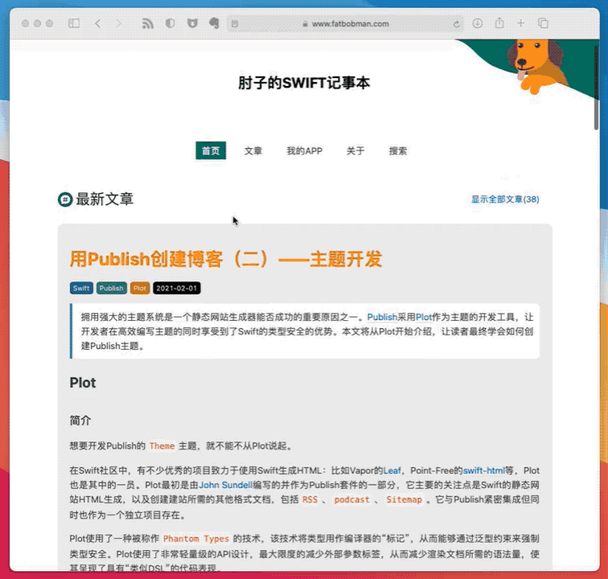

# local-search-engine-for-Publish



Visit [here](https://www.fatbobman.com/tags/) to test.

A [Publish](https://github.com/JohnSundell/Publish) Plugin

这是[hexo-generator-search](https://github.com/wzpan/hexo-generator-search)的Publish实现。
其中的javascripte完全来自于[hexo-generator-search](https://github.com/wzpan/hexo-generator-search)

将search.css中的内容添加到styles.css中

在Pipeline中添加

```swift
.generateHTML(withTheme: .fatTheme),
.makeSearchIndex(includeCode: false), //建立index索引
.generateRSSFeed(
```

includeCode为是否需要在索引中添加文章中的代码CodeBlock

在需要加入搜索框的地方，加入

searchResult 搜索结果显示

searchInput 搜索框

另外需要在head中进入jQuery

